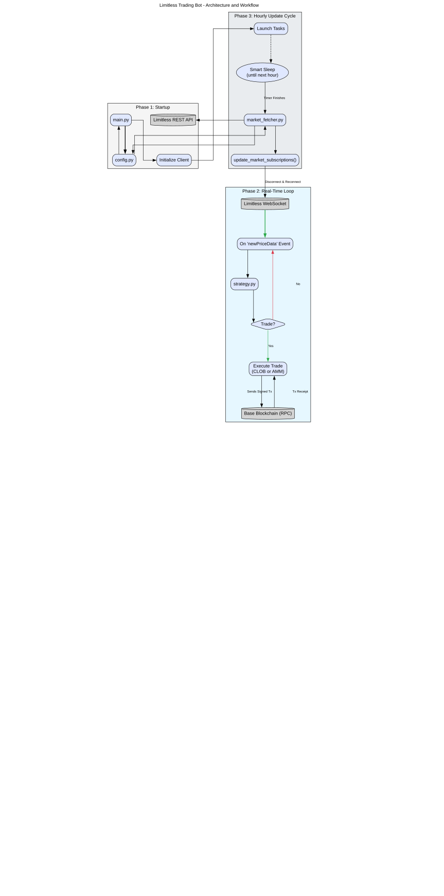

# Limitless Exchange - Autonomous Trading Bot

[](https://opensource.org/licenses/MIT)
[](https://www.python.org/downloads/)

An autonomous, event-driven trading bot designed to operate 24/7 on the [Limitless Exchange](https://limitless.exchange/). Built with Python's `asyncio` for high-performance, non-blocking operations, this bot connects to real-time price feeds, manages its state, and executes on-chain transactions for both CLOB (Central Limit Order Book) and AMM (Automated Market Maker) market types.

---

## Architecture Diagram

## Architecture Diagram

This flowchart illustrates the bot's architecture, from startup and configuration to the real-time trading loop and the autonomous hourly update cycle.



## Core Features

-   **Fully Autonomous 24/7 Operation:** Designed to be deployed on a server as a `systemd` service for continuous, reliable execution.
  
-   **Dual Trading Architecture:** Intelligently identifies and interacts with two distinct market types:
    -   **CLOB Markets:** Executes trades by submitting signed EIP-712 orders to the exchange's REST API.
    -   **AMM Markets:** Executes trades by sending signed transactions directly to the market's smart contract on the Base blockchain.
      
-   **Sophisticated Strategy Engine:** Implements a time-aware "endgame" strategy with dynamic position sizing based on configurable conviction levels. It only enters trades within a specific time window before market resolution.
  
-   **Stateful Position Management:** Tracks open positions (`OPEN_POSITIONS`) to manage exits (e.g., stop-loss) and uses a separate state (`traded_markets`) to prevent duplicate entries within the same hour.
  
-   **Robust On-Chain Capabilities:**
    -   Handles modern EIP-1559 gas fee calculations for reliable transaction inclusion.
    -   **Cost-Aware Trading:** Includes a gas price check to abort transactions if estimated network fees exceed a defined USD threshold.
    -   **Automatic Approvals:** Intelligently checks and performs on-chain `approve` (for ERC20/USDC) and `setApprovalForAll` (for ERC1155/share tokens) transactions only when necessary.
    -   **Concurrency-Safe:** A thread-safe `NonceManager` ensures multiple, near-simultaneous trade signals don't cause "nonce too low" errors.
      
-   **Resilient Networking & Lifecycle Management:**
    -   The hourly market update task uses a "smart timer" and a "verification loop" to gracefully handle the transition between market periods, ensuring it always subscribes to fresh, valid markets.
    -   Includes retry mechanisms for network-dependent connections.
      
-   **Detailed Record Keeping:**
    -   Maintains a rotating `bot.log` file for operational activity.
    -   Keeps a structured `trades.csv` file, logging every entry and exit with detailed metrics for easy performance analysis.

---

## A Critical Note on API and Data Structure Changes

> **Warning:** This bot is tightly coupled to the live data formats provided by the Limitless Exchange's API and WebSocket services. It is not an official product and is not guaranteed to be maintained.
>
> **If Limitless changes the structure of their API responses, WebSocket events, or smart contract ABIs, this bot WILL break.**
>
> Key areas of sensitivity include:
> -   The structure of the market data from the `/markets/active` endpoint (e.g., the format of `positionIds`, `tags`, or the `tokens` object).
> -   The names of WebSocket events (e.g., `newPriceData`).
> -   The smart contract ABIs for both AMM and token contracts.
>
> Users of this code are responsible for monitoring for such changes and updating the parsing and interaction logic accordingly.

---

## Technology Stack

-   **Core:** Python 3.10+, `asyncio`
-   **Networking:** `python-socketio` (WebSocket), `aiohttp` (REST/RPC)
-   **Blockchain:** `web3.py` (Async) for all on-chain interactions on the Base network.
-   **Configuration:** `python-dotenv`

---

## Setup and Installation (Local Development)

### Prerequisites

-   Git
-   Python 3.10 or higher
-   An RPC URL for the Base Mainnet from a provider like [Alchemy](https://www.alchemy.com/) or [Infura](https://www.infura.io/).

### 1. Clone the Repository

```bash
git clone https://github.com/drjollof/limitless-bot.git
cd limitless-bot
```

### 2. Set Up the Python Environment

Using a virtual environment is strongly recommended.

```bash
# Create a virtual environment
python3 -m venv venv

# Activate it
# On Windows:
venv\Scripts\activate
# On macOS/Linux:
source venv/bin/activate
```

### 3. Install Dependencies

```bash
pip install -r requirements.txt
```

### 4. Configure Environment Variables

Create a `.env` file in the project root. You can copy the example file to start.

```bash
cp .env.example .env
```

Now, edit the `.env` file with your secret keys and URLs. **This file should never be committed to Git.**

```dotenv
# Your Ethereum wallet's private key (without the '0x' prefix)
PRIVATE_KEY="YOUR_ETHEREUM_PRIVATE_KEY"

# Your RPC URL for the Base Mainnet from a provider like Alchemy
BASE_RPC_URL="https://base-mainnet.g.alchemy.com/v2/YOUR_ALCHEMY_KEY"

# Limitless Exchange URLs and Contract Addresses (verify these with official docs)
API_BASE_URL="https://api.limitless.exchange"
WS_URL="https://ws.limitless.exchange"
CLOB_CFT_ADDR="0x0bA342265432a255961605495573752B35a165d4"
USDC_ADDRESS="0x833589fcd6edb6e08f4c7c32d4f71b54bda02913"

# Set to "true" to enable verbose debug logging for troubleshooting
DEBUG="false"
```

## Running the Bot (Local)

```bash
python main.py
```

The bot will start, connect, and begin logging its activity to the console and to the `logs/bot.log` file. Press `Ctrl+C` to stop it gracefully.

---

## Strategy Configuration

The bot's trading parameters can be easily tuned by editing the constants at the top of the `strategy.py` file.

```python
# In strategy.py

# --- STRATEGY CONFIGURATION ---
TIME_WINDOW_MINUTES = 15
HIGH_CONVICTION_THRESHOLD = 0.90
HIGH_CONVICTION_SIZE_USD = 3.0
MEDIUM_CONVICTION_THRESHOLD = 0.70
MEDIUM_CONVICTION_SIZE_USD = 1.0
STOP_LOSS_LEVEL = 0.20
# ----------------------------
```


## On-Chain Requirements

For the bot to execute trades, the wallet specified by `PRIVATE_KEY` needs:
1.  **ETH Balance:** A small amount of ETH on the Base network to pay for gas fees.
2.  **USDC Balance:** The USDC collateral it will use for trading.
3.  **Approvals:** The bot is designed to automatically handle the necessary one-time approval transactions (both for USDC and for the share tokens), but this will be its first on-chain action and will require gas.

## Project Structure

A brief overview of the key files in the project.

```
/

├── main.py             # Main entry point, orchestrates all services
├── requirements.txt    # Python package dependencies
├── config/
│   ├── markets.json    # Cached market data (auto-generated)
│   ├── amm_abi.json    # ABI for the AMM smart contract
│   └── usdc_abi.json   # Minimal ABI for USDC
├── logs/
│   ├── bot.log         # Main rotating log for bot activity
│   └── trades.csv      # Structured log of all executed trades
└── scripts/
    ├── config.py           # Loads configuration from .env and market_fetcher
    ├── market_fetcher.py   # Fetches and validates market data from the API
    ├── strategy.py         # Contains all trading and position management logic
    ├── websocket.py        # Core client for WebSocket, on-chain trades, and state
    ├── trade_logger.py     # Utility for writing structured trade data to CSV
    └── trade_utils.py      # Handles low-level EIP-712 order signing for CLOB markets
```

## License

This project is licensed under the MIT License.
```